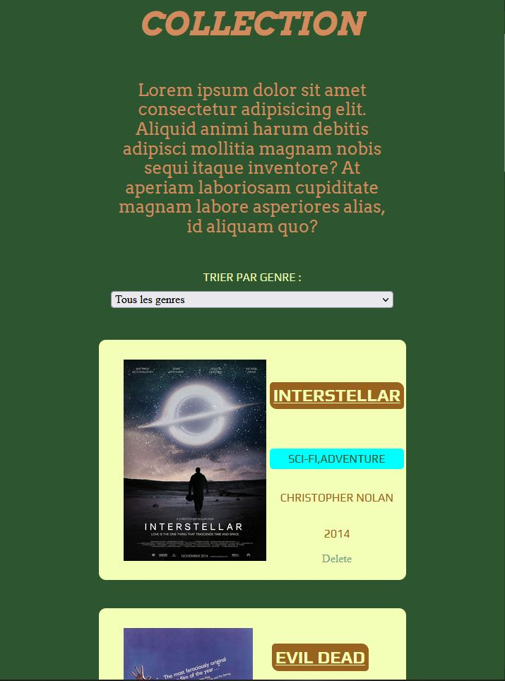

# Project "The Collection"

The goal of this project will be to summarize our current knowledge of :

    HTML and CSS
    Responsive design
    Javascript Basics
    The DOM

to create a collection of items. This project will be split up in two parts.

## Features

- Generate an array with a collection of movies.
- Display this array in cards.
- For each of these item you'll have to find relevant information about it (title, genre, director, date of release and a resume).
- Remove a movie from the collection with a delete button.
## Screenshots

Screenshot from the project "The Collection".

